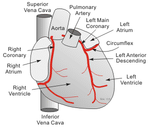

# Cardiac Anatomy

## Athlerosclerosis

Athlerosclerosis occluds arteries, and when a large amount of a coronary artery is obstructed, angina can occur. The process of athlerosclerotic development is as follows:

1. LDL accumulation and oxidation in the wall of a vessel
2. Macrophage infiltration and uptake of the LDL deposit
3. Formation of foam cells
4. Smooth Muscle proliferation and Cap formation
5. Cap rupture
6. Thrombosis

# General Angina

## Pathophysiology

Oxygen demand to cardiac tissue exceeds the ability of coronary circulation to supply oxygen to the cardiac myocytes, leading to ischemia and chest pain

## Oxygen Supply and Demand

**Preload:** Decreased preload is caused by veinous vasodilation, resulting in decreased oxygen consumption and increased myocardial perfusion

**Afterload:** Decreased afterload is caused by arterial vasodilation, leading to decreased oxygen consumption

**Heart Rate:** Decreased HR leads to decreased oxygen consumption and increased coronary perfusion

## Risk Factors

* Age: &ge; 55 for men or &ge; 65 for women
* Smoking
* DM
* HTN
* Kidney Disease
* Obesity
* Sedentary Lifestyle

# Stable Angina

## Pathophysiology

Stable angina is a demand ischemia caused by a temporary increase in O2 demand by cardiac myocytes in the prescense of a diminished O2 supply, most commonly the result of severe ASCVD leading to significant decreases in blood flow (&gt;70%) through the coronary arteries **without** myocardial necrosis. Stable angina can be of either a fixed threshold, a variable threshold, or both. Stable angina should have stable characteristics for at least 2 months.

## Clinical Presentation and Dx

### Dx

* Look for risk factors
* ST-Depression **During** Angina
* Stress Test
* Cardiac Catheterization
* Electron Beam CT (AHA does not reccomend because results will not change recommendation)

### PQRST

* Precipitating Factors: Exertion etc
* Palliative Measures: Rest and/or SL NTG
* Quality of Pain: Squeezing, heaviness, tightening, etc
* Region and Radiation: Substernal, ocassionally radiating to left arm
* Severity of Pain: Generally &gt;5
* Timing: Typically 5-10min, must be &lt; 20

### Common Precipitating Factors

* Cold Air (leads to increased HR)
* Large Meals
* Exertion
* Smoking

### EKG Findings

ST-Depression **only during episodes of angina**, EKG is otherwise unremarkable

## Treatment

### Common Drug Classes for Treatment

* Organic Nitrates: Dilation of Venous Blood Vessels to Reduce Preload
  * Glyceryl Trinitrate for acute attacks
  * IS(M/D)N for prophylaxis
* DHP CCBs: Arterial Vasodilation to Decrease Afterload
* Non-DHP CCBs: Negative Inotropy and Chronotropy to Decrease Oxygen Consumption
* &beta;-Blockers: Negative Inotropy and Chronotropy to Decrease Oxygen Consumption
* Ivabradine: Negative Chronotropy via HCN Inhibition to Decrease Oxygen Consumption
* Ranolazine: Inhibits late-Na current to inhibit reverse calcium transport during ischemic attacks
* Statins: Decrease Athlerosclerosis
* Paclitaxel: Binds and Stabilizes Microtubules to prevent mitosis in stent placement
* Sirolimus: Binds FKBP12, inhibiting mTOR and arresting the cell cycle at the G1-S transition

###  Algorithm

# Prinzmetal's (Variable) Angina

## Pathophysiology

Prinzmetal's angina is a supply ischemia resulting from spontaneous vasospasm in the coronary vessels, typically the result of athlerosclerotic insult to the endothelium, leading to a short-lived ischemia. Prinzmetal's angina typically presents at night when parasympathetic tone is higher.

## Treatment

### Common Drug Classes for Treatment

* Organic Nitrates: Dilation of Venous Blood Vessels to Reduce Preload
  * Glyceryl Trinitrate for acute attacks
  * IS(M/D)N for prophylaxis
* DHP CCBs: Arterial Vasodilation to Decrease Afterload
* Non-DHP CCBs: Negative Inotropy and Chronotropy to Decrease Oxygen Consumption
* &beta;-Blockers: Negative Inotropy and Chronotropy to Decrease Oxygen Consumption
* Ivabradine: Negative Chronotropy via HCN Inhibition to Decrease Oxygen Consumption
* Ranolazine: Inhibits late-Na current to inhibit reverse calcium transport during ischemic attacks
* Statins: Decrease Athlerosclerosis

# Unstable Angina

## Pathophysiology

Unstable angina is supply ischemia characterized by a rapid worsening of athlerosclerosis of a coronary vessel in which the cap of the deposit ruptures, leading to thrombus formation. Unstable angina typically onsets suddenly and typically warns of an impending MI.

## Treatment

### Common Drug Classes for Treatment

* ASA: Decrease Platelt Aggregation / Inhibit Thrombus Formation
* P2Y12 Inhibitors (Clopidogrel, Prasgurel, Ticagrelor): Inhibit Platelt Activation / Inhibit Thrombus Formation
* Heparin: Inhibition of Thrombin via AT-III to inhibit coagulation cascade

# Cardiac Syndrome X

# Silent Myocardial Ischemia

