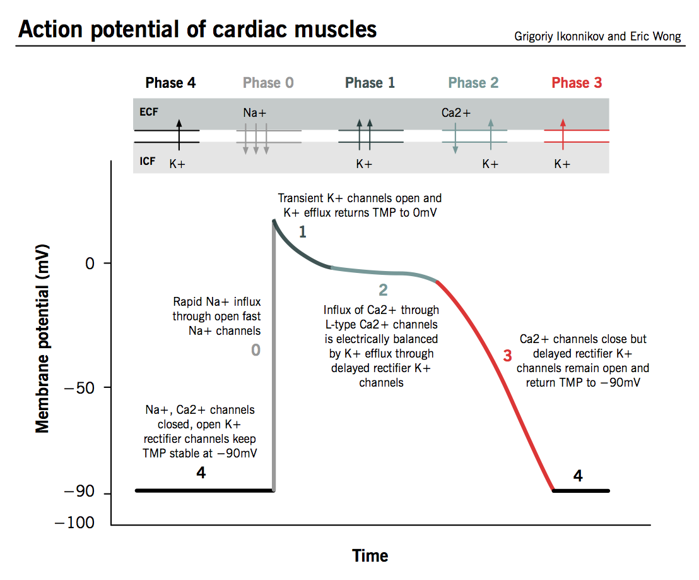
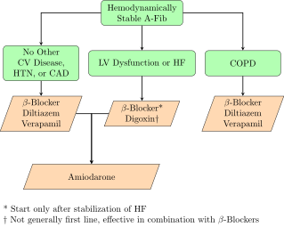

# Cardiac Conduction Physiology

Pacemaker cells are primarily governed by Ca channels, while myocytes are governed by Na channels. Activation of &beta; receptors leads to increased levels of cAMP which directly stimulates HCN channels to open, and through activation of PKA stimulates the activation of Ca channels. Cholinergic activation opposes this by activation of Gi.

## Vaughan-Williams-Singh Antiarrhythmic Scale

* Class 1: Na Channel Blockers 
  * 1a: Mixed Na and K Blockade (moderate dissociation), blocks open state of Na, widens QRS and prolongs QT
  * 1b: Fast dissociation, slightly shortens phase 2, minimal clinical impact
  * 1c: Strong (slow dissociation) Na blockade slowing 0, widens QRS
* Class 2: &beta;-blockers
* Class 3: K Blockers
* Class 4: non-DHP CCBs

# EKG Normal Values

|               | Interval (ms) |
| ------------- | ------------- |
| PR Interval   | 120-200       |
| QRS           | 80-120        |
| QT*           | 380-460       |
| QTc (Male)*   | 360-470       |
| QTc (Female)* | 360-480       |

*High risk of Torsades w/ QTc &ge; 500ms

# Sinus Bradycardia (Sick Sinus Syndrome)

A sinus, regular rhythm with a HR &lt; 60 BPM

## Risk Factors

* Myocardial infarction or ischemia
* Abnormal sympathetic or parasympathetic tone
* Electrolyte abnormalities
  * Hyperkalemia
  * Hypermagnesemia
* Drugs
  * Digoxin
  * ß-blockers
  * CCBs (Diltiazem, verapamil)
  * Amiodarone
  * Dronedarone
  * Ivabradine
* Idiopathic

## SSx

* Hypotension
* Dizziness
* Syncope

## Treatment

**Only treat symptomatic patients**

* Atropine 0.5mg q5min to max of 3mg or 0.04 mg/kg
  * Tachycardia
  * Urinary retention
  * Blurred vision
  * Dry mouth
  * Mydriasis
* Refractory to Atropine
  * Transcutaneous pacing
  * Dopamine 2-10 mcg/kg/min
  * Epi 2-10 mcg/min
* Long term treatment may require permanent pacemaker

# Atrial Fibrillation

Characterized by an irregularly irregular rhythm with a ventricular rate of 120-180 BPM. P waves are often absent. A-fib is usually caused by abnormal atria or pulmonary vein automaticity sustained by atrial reentry circuits.

## Classifications of A-fib

* Paroxysmal
  * Intermittent episodes
  * Episodes start suddenly and spontaneously, last for minutes to hours, and terminate suddenly and spontaneously
* Persistent
  * A continuous episode of AF that does not terminate spontaneously
  * May last > 7 days
* Long-standing persistent
  * Continuous AF > 12 months in duration
* Permanent
  * Pt never returns to sinus rhythm and cannot be converted
  * Usually a joint decision to stop escalating therapy
* Nonvalvular
  * Not accompanied by any valvular disease

## Risk Factors

* HTN
* CAD
* CHF
* Old age
* DM
* Obesity
* OSA
* Valvular heart disease
* Rheumatic heart disease
* Smoking
* Genetic
* IdiopathicHyperthyroidism
* PE
* Thoracic Surgery
  * Coronary artery bypass graft (CABG)
  * Lung resection
  * Esophagectomy
* Excessive EtOH use

## SSx

* Asymptomatic A-fib is somewhat common
* Palpitations
* Dizziness
* Fatigue
* Lightheadedness
* SOB
* Hypotension
* Syncope
* Angina (if pt has CAD)
* CHF exacerbation

## Treatment Goals

| Persistent A-Fib                  | Paroxysmal A-Fib                  | Permanent A-Fib                   |
| --------------------------------- | --------------------------------- | --------------------------------- |
| Ventricular Rate Control          | Ventricular Rate Control          | Ventricular Rate Control          |
| Prevention of Stroke and Emoblism | Prevention of Stroke and Emoblism | Prevention of Stroke and Embolism |
| Convert to Sinus Rhythm           | Maintain Sinus Rhythm             |                                   |

## Drug Therapy

| Drug      | Loading Dose            | Daily Dose                        | SEs  | Notes |
| --------- | ----------------------- | --------------------------------- | ---- | ----- |
| Diltiazem | 0.25 mg/kg IV over 2min | 5-15 mg/hr or 120-360 mg ER PO QD |      |       |

**CONTINUE HERE ON SLIDE 41**

## Stable Treatment Algorithm

