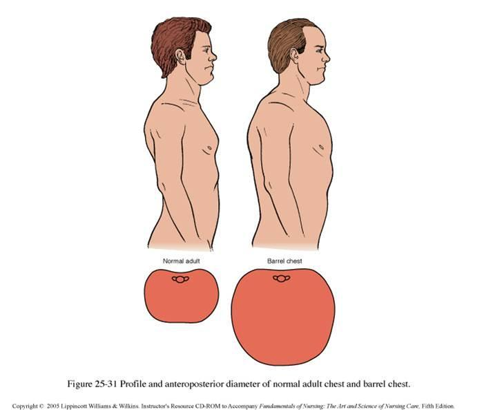

# Pathophysiology

COPD is characterized by chronic bronchitis, emphysema, and inflamed airways. Emphysema is the abnormal enlargment of airspaces due to the destruction of alveolar wall tissue. Bronchitis is characterized by the inflammation of the bronchioles leading to hypertrophy and fibrosis of the respiratory smooth muscle, accompanied by mucosal gland enlargement and ciliary abnormalities. In the case of COPD, inflammation refers to increased oxidative stress, increased levels of proteases with decreased levels of antiproteases, as well as inflammation due to irritants such as cigarette smoke.

# Diagnosis and Staging

## S/Sx

* Chronic Cough
* Dyspnea
* Increased Sputum Production
* Increased RR
* Use of Accessory Muscles to Breath
* Barrel Chest
* Decreased Breath Sounds
* Prolonged Exertion

## Risk Factors

* Smoking
* Genetics
* Age
* Hx of Asthma or other Reactive Airway Diseases
* Respiratory Infections
* FHx

## Diagnosis

Spirometric Assessment with FEV1/FVC &lt; 0.7

## Staging

### Symptomatic Assessment

| Stage | Symptomatic Assessment     | Exacerbations                  |
| :---- | :------------------------- | :----------------------------- |
| A     | CAT &lt; 10 OR mMRC &le; 1 | &le;1                          |
| B     | CAT &ge; 10 OR mMRC &ge; 2 | &le;1                          |
| C     | CAT &lt; 10 OR mMRC &le; 1 | &ge;2 OR &ge;1 Hospitalization |
| D     | CAT &ge; 10 OR mMRC &ge; 2 | &ge;2 OR &ge;1 Hospitalization |

### Spirometric Airway Limitation

| Stage  | Impairment  | FEV1 / FVC | FEV1     |
| :----- | :---------- | :-------------------- | :------------------ |
| GOLD 1 | Mild        | &lt;0.7               | &ge;80% Predicted   |
| GOLD 2 | Moderate    | &lt;0.7               | [50%,80%) Predicted |
| GOLD 2 | Severe      | &lt;0.7               | [30%,50%) Predicted |
| GOLD 3 | Very Severe | &lt;0.7               | &lt;30% Predicted   |

### mMRC Grading

| mMRC Grade | Severity of Breathlessness               |
| :--------- | :--------------------------------------- |
| 0          | SOB w/ Strenuous Exercise                |
| 1          | SOB w/ Moderate Exertion (e.g. walking uphill or walking quickly) |
| 2          | SOB w/ Normal Activity (e.g. cannot keep up with others or must stop at normal pace) |
| 3          | SOB w/ Mild Activity (Walking for &lt;100m) |
| 4          | Cannot leave the house, SOB w/ dessing/undressing |

# Treatment Selection

| GOLD Group | 1st Line       | 2nd Line          |
| :--------- | :------------- | :---------------- |
| A          | Bronchodilator | Try Another Class |
| B          | LABA           | LABA + LAMA       |
| C          | LAMA           | LABA + LAMA       |
| D          | LABA + LAMA    | LABA + LAMA + ICS |

GOLD C can conider a LABA + ICS combination for second line therapy; however it is not as effective. GOLD D can consider Roflumilast if FEV1 &lt; 50% predicted w/ chronic bronchitis, and macrolide Abxs can be considered for former smokers.

# COPD Exacerbations

## Treatment

* Albuterol w/ or w/o Ipratropium
* Prednisone 40mg PO QD x5d
* Abx
  * Macrolides, Amoxicillin/Clavulantate, or Tetracyclines x5-7d
  * Indicated w/ Ventilator Use or w/ Purulent Sputum and either Increased Sputum Volume or Dyspnea
* Can provide supplemental O2

## Discharge Criteria

* SABA not needed more than q4h
* Pt can cross room if they could at baseline
* Pt can eat and sleep w/o frequent awakening
* Clinically stable for 12-24hr

# Common Inhalers

| Brand Name                  | Active Ingredient(s)          | Class(es)   |
| :-------------------------- | :---------------------------- | :---------- |
| ProAir, Ventolin, Proventil | Albuterol                     | SABA        |
| Xopenex                     | Levalbuterol                  | SABA        |
| Atrovent                    | Ipratropium                   | SAMA        |
| Combivent                   | Albuterol / Ipratropium       | SABA / SAMA |
| QVAR                        | Beclomethasone                | ICS         |
| Pulmicort                   | Budesonide                    | ICS         |
| Alvesco                     | Ciclesonide                   | ICS         |
| Aerospan                    | Flunisolide                   | ICS         |
| Flovent, ArmonAir           | Fluticasone Propionate        | ICS         |
| Arnuity                     | Fluticasone Furoate           | ICS         |
| Asmanex                     | Mometasone                    | ICS         |
| Brovana                     | Arformoterol                  | LABA        |
| Foradil                     | Formoterol                    | LABA        |
| Arcapta                     | Indacaterol                   | LABA        |
| Striverdi                   | Olodaterol                    | LABA        |
| Servent                     | Salmeterol                    | LABA        |
| Tudorza                     | Aclidinium                    | LAMA        |
| Spiriva                     | Tiotropium                    | LAMA        |
| Incruse                     | Umeclidinium                  | LAMA        |
| Advair, AirDuo              | Fluticasone / Salmeterol      | ICS / LABA  |
| Symbicort                   | Budesonide / Formoterol       | ICS / LABA  |
| Dulera                      | Mometasone / Formoterol       | ICS / LABA  |
| Breo                        | Fluticasone / Vilanterol      | ICS / LABA  |
| Stiolto                     | Olodaterol / Tiotropium       | LABA / LAMA |
| Anoro                       | Vilanterol / Umeclidinium     | LABA / LAMA |
| Utibron                     | Indacanterol / Glycopyrronium | LABA / LAMA |
| Bevespi                     | Formoterol / Glycopyrronium   | LABA / LAMA |

# Guidlines

* [2017 GOLD Pocket Guidlines](http://goldcopd.org/wp-content/uploads/2016/12/wms-GOLD-2017-Pocket-Guide.pdf)
* [2017 GOLD Guidlines](http://goldcopd.org/gold-2017-global-strategy-diagnosis-management-prevention-copd/)

# References

* Barrel Chest Image Available at [https://ratedmedicine.wordpress.com/barrel-chest/](https://ratedmedicine.wordpress.com/barrel-chest/)
