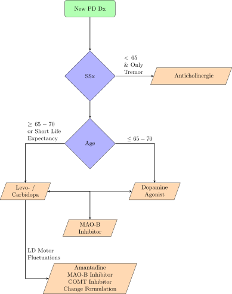

# Pathophysiology

PD is caused by death of dopaminergic neurons in the *substantia nigra* which compromises transmission through the nigrostriatal system. Histological sections of the *substantia nigra* and other regions of the brain in PD contain Lewy Bodies (bundles of proteins inside neurons formed from &alpha;-synuclein).  These damaging Lewy Bodies progress through the Braak Stages

1. Lower Brainstem
2. Raphe
3. *Substantia Nigra*
4. Mesocortex / Thalamus
5. Neocortex / Prefrontal Cortex
6. Entire Neocortex

Environmental factors though to contribute to PD include toxins which trigger oxidative stress and mitochondrial dysfunction.

## The *Substantia Nigra*

The SN provides input to the basal ganglia associated with some cognitive functions and voluntary motor control, as well as supplies dopamine to the striatum.

There is a direct and indirect dopamine signaling pathway from the SN, going through the basal ganglia and thalamus, and ending in the cortex. The direct pathway primarily utilizes D1 receptors, while the indirect primarily utilizes D2 receptors.

# Dx

## SSx

* Resting tremor (primarily onone side of body)
* Rigidity (muscle stiffness)
* Bradykinesia (slow movement)
* Impaired balance / coordination
* Mask-like appearance
* Speech difficulties
* Cognitive deficits
* Anxiety / Depression
* Constipation
* Orthostatic Hypotension
* Sexual Dysfunction
* Insomnia

## Disease Assesment

Unified Parkin's Disease Rating Scale: Higher scores imply worsening SSx

# Treatment

## Non-Pharmacologic Therapy

* Exercise / PT / OT
* Nutritional Counseling
* Psychotherapy / Support Groups
* Speech Therapy

## Drug Therapy

**CONTINUE HERE WITH DOSING AND LD MOTOR SSX MANAGMENT**