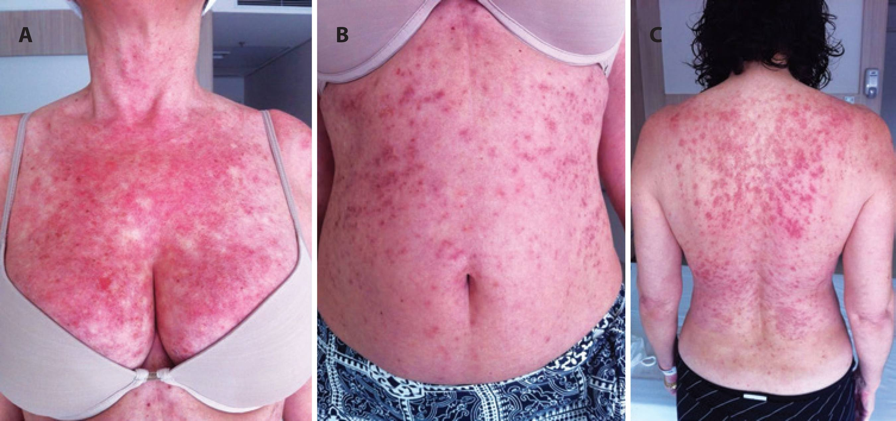

# Seizure Classification

## Focal Szs

Focal Szs are classified as either preserved (simple partial) or altered (complex partial) awareness. Simple Szs can degenerate into complex, and either can evolve into bilateral, generalized, tonic-clonic szs.

* Aware Partial Szs
  * Limited Convulsions, No LOC, and Limited Sensory Disturbances
  * May Present w/ auras of abdominal discomfort, unpleasant smells, or a sense of fear
* Impaired Awareness Partial Szs
  * Present w/ clouding of consciousness, staring, and repetitive motor behaviors
  * May also present with autonomic dysfunction (diarrhea, vomiting, etc)
  * Auras are common (same SSx as Aware Partial Szs)
  * Most common form of focal Sz

## Generalized Szs

Generalized Szs can be classified as the following

* Absence
  * No Convulsions, Aura, or Post-Ictal Period
  * Typical (Petit-Mal Szs): Brief LOC (10-45s) w/ staring or eye flickering, often repetitive
  * Atypical: Slower onset than Petit-Mal and more difficult to control
* Myoclonic
  * Shock-Like Muscle Contractions
  * Isolated location jerking (head, trunk, etc)
* Tonic
  * Often occur in children
  * Increased rigidity of extensor muscles
* Clonic
  * Often occur in children
  * Rapid, repetitive motor activity
* Tonic-Clonic (Grand-Mal)
  * Cyclical tonic phase (15-30s of muscle rigidity) followed by clonic phase (1-2min of violent jerking)
  * Tremor begins to develop in tonic phase as clonic phase begins
  * Commonly presents w/ urinary incontinence
  * Characteristic of Epilepsy
* Atonic
  * Sudden loss of muscle tone
* Status Epilepticus
  * Single Sz or Multiple Szs w/o baseline consciousness for &ge; 30min
  * Usually begin treatment after &gt; 5min

## Post-Ictal States

Post-Ictal states can last from seconds to hours, and depending upon the length of the Sz, age of the patient, use of anti-epileptic drugs (AEDs), and areas of the brain that are affected.

### SSx

* Confusion
* Disorientation
* Anterograde Amnesia

# Seizure Pathophysiology

An imbalance in Excitatory and Inhibitory Post-Synaptic Potentials leads to the development of a Sz. Excitatory potentials are often caused by AMPA and NMDA receptors (glutamate receptors) leading to Ca influx and depolarization. Hyperpolarization is often mediated by GABA receptors leading to K efflux through both voltage gated and Ca defendant K efflux channels. Tonic phases of Szs are often carried out by loss of GABA mediated inhibition leading to excessive activation by glutamate, and clonic phases/oscillations occur due to the reintroduction of GABA mediation. 

# Status Epilepticus Managment

## Common Triggers

* Prenatal Injury
* Hemorrhage
* Infection
* Trauma
* Tumors
* Cerebrovascular Disease
* Anoxia
* Hyperventillation / Respiratory Alkalosis
* Hypoglycemia
* Sleep Deprivation
* Stress
* DTs
* AED Withdrawal
* Repetitive Light Stimulation

## Drug Triggers

* EtOH
* Burpropion
* Theophylline
* Imipenem
* Phenothiazines
* Oral Contraceptives
* Tramadol
* Depressant Withdrawal (Esp EtOH and Benzos)
* Meperidine
* CNS Stimulants
* Memantine
* Heave Metal Toxicity
* Clozapine

## Management of Status Epilepticus

1. 0-5min
   * ABCs
   * EEG
   * Blood Glucose
     * If &lt; 60, give 100mg IV Thiamine and 50mL IV D5W
   * CBC w/ Diff
   * Comprehensive Metabolic Panel (CMP)
   * Toxicology Screen
2. 5-20min
   * Midazolam IM 10mg if &gt; 40kg or 5mg if 13-40kg (one dose)
   * Lorazepam 0.1 mg/kg IV (Max 4 mg/dose) (Max of 2 doses)
   * Diazepam 0.15-2 mg/kg IV (Max 10 mg/dose) (Max of 2 doses)
   * Phenobarbital 15 mg/kg/dose IV (single dose, **not preferred agent**)
   * Diazepam 0.2-0.5 mg/kg Rectal (Max 20 mg/dose) (**not preferred agent**)
   * Intranasal Midazolam or Buccal Midazolam (**not preferred agent**)
3. 20-40min
   * Fosphenytoin 20 mg PE/kg IV (Max 1500 mg PE/dose, single dose) (PE = Phenytoin Equivalents)
   * Valproic Acid 40 mg/kg IV (Max 3000 mg/dose, single dose)
   * Levetiracetam 60 mg/kg IV (Max 4500 mg/dose, single dose)
   * Phenobarbital 15 mg/kg/dose IV (single dose, **not preferred agent**)
4. 40-60min
   * Repeat Second Line Therapy (Step 3) OR
   * Anesthetic Doses of the following PLUS Continuous EEG
     * Thiopental
     * Midazolam
     * Phenobarbital
     * Propofol

# Seizure Management

## Criteria for Considering D/C of AED

2-5yr Sz free period

Risk Factors for recurrence include:

* &lt; 2 years seizure free
* Onset of seizure after age 12
* History of atypical febrile seizures
* 2-6yr before good seizure control in treatment
* Significant number of seizures (&gt; 30) before control achieved
* Partial seizures (which is the most common type)
* Abnormal EEG throughout treatment
* Organic neurological disorder
  * Traumatic brain injury
  * Dementia
* Withdrawal of phenytoin or valproate

## Medication Therapy

### Typical First-Line Therapy by Sz Type

| Sz Class       | Typical 1st Line Agents                                      |
| -------------- | ------------------------------------------------------------ |
| Partial-Onset  | Carbamazepine Lamotrigine Levetiracetam Oxcarbazepine Valproate |
| Tonic-Clonic   | Carbamazepine Lamotrigine Oxcarbazepine Valproate |
| Absence        | Ethosuximide Lamotrigine Valproate                 |
| Myoclonic      | Levetiracetam Topiramate Valproate                 |
| Lennox-Gastaut | Valproate Lamotrigine                                   |

### Drug Interactions

| Enzyme | Substrate                                                    | Inducer                                                      | Inhibitor                                                    |
| ------ | ------------------------------------------------------------ | ------------------------------------------------------------ | ------------------------------------------------------------ |
| 1A2    | Carbamazepine                                                | Carbamazepine Phenobarbital Phenytoin Primidone |                                                              |
| 2C9    | Brivaracetam Phenobarbital Phenytoin Primidone Valproate | Carbamazepine Phenobarbital Phenytoin Primidone |                                                              |
| 2C19   | Brivaracetam Lacosamide Phenobarbital Phenytoin Primidone Valproate | Carbamazepine Phenobarbital Phenytoin Primidone | Eslicarbazepine Lacosamide Oxcarbazepine Topiramate |
| 2D6    |                                                              |                                                              | Clobazam                                                     |
| 3A4    | Carbamazepine Clobazam Clonazepam Ethosuximide Felbamate Preampanel Tiagabine Zonisamide | Carbamazepine Clobazam Eslicarbazepine Felbamate Lamotrigine Oxcarbazepine Phenobarbital Phenytoin Primidone Rufinimide Topiramate **REDUCE OC EFFICACY** |                                                              |
| UGT    |                                                              | Carbamazepine Eslicarbazepine Phenobarbital Phenytoin Primidone | Valproate                                                    |

#### Contraceptive Use

Contraceptive interactions are primarily mediated through CYP3A4 alterations leading to increased breakdown of the estrogen component of contraceptives. Contraceptives must be used in patients on anticonvulsants, as almost all anticonvulsants are teratogenic. This interaction can be avoided by utilizing progestin-only formulations, high dose estrogen OCs, IUDs, etc.

### Phenytoin / Fosphenytoin

* Phenytoin: 20 mg/kg IV w/ a second dose after 10min if needed
* Phenytoin: Maximum Infusion Rate of 50 mg/min IV
* Fosphenytoin: 20 PE/kg IV w/ a second dose after 10min if needed
* Fosphenytoin: Maximum Infusion Rate of 150 PE/min IV
* Phenytoin Limiting SE of Infusion rate is hypotension due to propylene glycol 
* Monitor for purple glove syndrome
* Cardiac Monitoring Required
* Oral Dose Conversion
  * Adjusted Concentration: $$\frac{\text{Observed Concentration}}{0.25*\text{Albumin}+0.1} $$
  * Albumin and serum concentration must be measured at the same time
* Target Concentration: 10-20 mcg/mL

###  Valproate

* Load 15-20 mg/kg
* Follow with 15 mg/kg QD titrated to Max 60 mg/kg QD
  * IV given in divided doses given Q6H
* IV:PO Conversion is 1:1
* Loading Dose Calculation
  * Dose: $$V_d * ([\text{Desired}]-[\text{Current}]) * Wt $$
  * Vd: 0.2-0.3 L/kg
  * Target Concentration: 80 mcg/kg (50-125 mcg/mL)

### Lamotrigine

| Without UGT Interactions | w/ UGT Inhibitor (Valproate) (Halve Dose) | w/ UGT Inducer (Carbamazepine, Phenytoin) (Double Dose) |
| ------------------------ | ---------------------------------------------- | ------------------------------------------------------------ |
| 25mg QD x14d             | 25mg QOD x14d                                  | 50mg QD x14d                                                 |
| 50mg QD x14d             | 25mg QD x14d                                   | 100mg QD x14d                                                |
| 100mg QD x7d             | 50mg QD x7d                                    | 200mg QD x7d                                                 |
| 200mg QD                 | 100mg QD                                       | 400mg QD                                                     |

Always re-evaluate lamotrigine dose if offending interaction is started or stopped. Titration schedule must be followed strictly to avoid high risk of SJS/TEN. In pts with prior exposure to lamotrigine higher initial doses may be used.

## Severe Adverse Drug Reactions

### Anticonvulsant Hypersensitivity Syndrome

AHS is a severe allergic reaction associated with arena oxide metabolic intermediate of aromatic drugs. The reaction presents as a diffuse, morbiliform rash. There is some cross reactivity with TCAs because of this. Common offenders include:

* Carbamazepine
* Oxcarbazepine
* Eslicarbazepine
* Felbamate
* Lamotrigine
* Phenobarbital
* Phenytoin
* Zonisamidde

Carbamazepine and its derivatives are the most common offenders, and a significantly increased risk of this reaction occurs in patients carrying HLA-B\*1502, which is most commonly seen in Asian populations. HLA-A\*3101 conveys some risk as well, and is common in those of Northern European descent.

### DRESS Syndrome

Drug Reaction with Eosinophilia and Systemic Symptoms is a life threatening allergic reaction which commonly initially presents with a similar rash to measles. The reaction then progresses to organ dysfunction and multi-system organ failure. DRESS commonly occurs 2-6wks after initiating one of the following:

* Carbamazepine
* Lamotrigine
* Phenobarbital
* Phenytoin
* Valproate
* Zonisamide

HLA-A*3101 (common in Asians and Northern European Populations) is commonly associated with an increased risk of DRESS syndrome. Treat by withdrawing drug and providing supportive care.

### Anticonvulsant Withdrawal Syndrome

Anticonvulsant withdrawal refers to the increased risk of Szs associated with abrupt discontinuation of anticonvulsant medications. Common other SSx include:

* Anxiety
* Agitation
* Other Physical Complaints

Anticonvulsant withdrawal syndrome can be prevented by slowly tapering patients off medication. Tapers of the course of a year are appropriate for trial D/C due to lack of Szs. Patients with non-life threatening SEs should be tapered slowly, but can be tapered faster than 1 year. Consider the longest taper medically feasible without undue danger or suffering to the patient.

# Pregnancy and Anticonvulsant Medications

Sz frequency increases during pregnancy, and dosing regimens may change. Unfortunately many anticonvulsants are known teratogens such as:

* Carbamazepine
* Clonazepam
* Fos-/Phenytoin
* Phenobarbital
* Primidone
* Topiramate
* Valproate

These medications should not be used in pregnancy if at all possible. Pregnant patients should be supplemented with Folate 5mg QD and consider Vit K 10mg QD in the last month of pregnancy followed by Vit K 1mg IM (for the infant) at birth.

**CONTINUE HERE AT DEPRESSION IN EPILEPSY SLIDE 26**